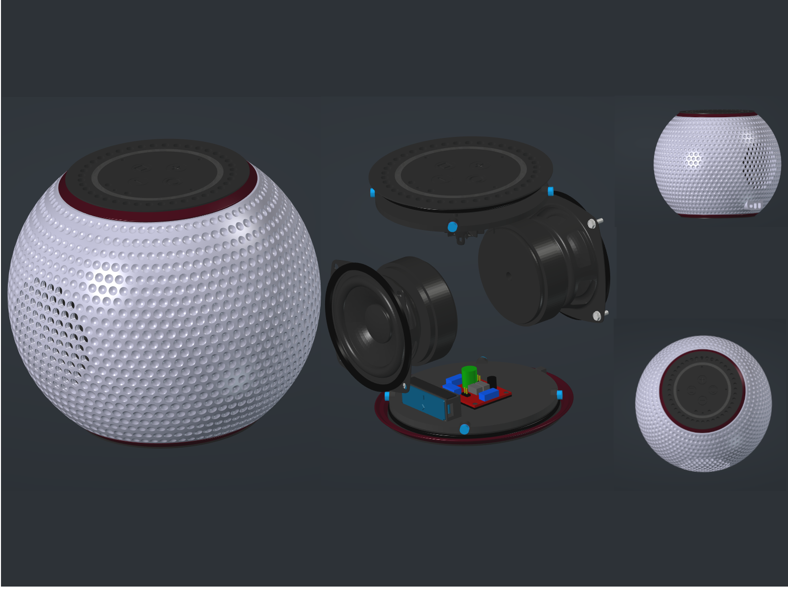
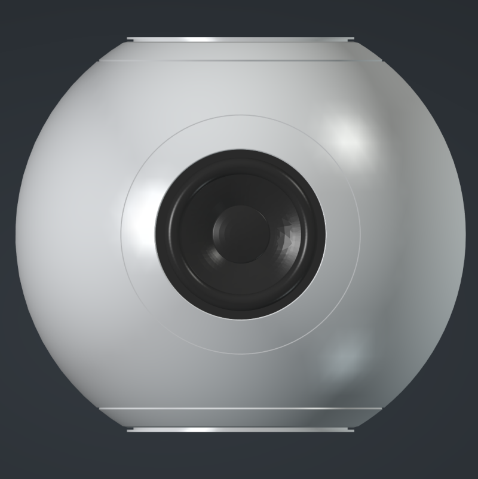
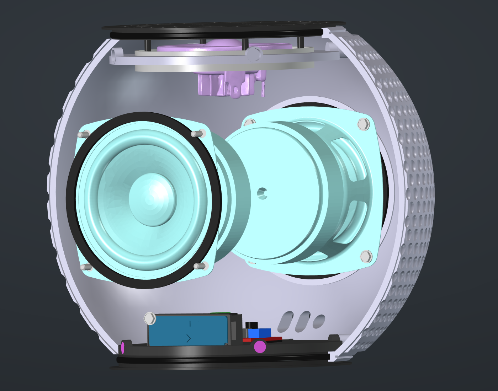
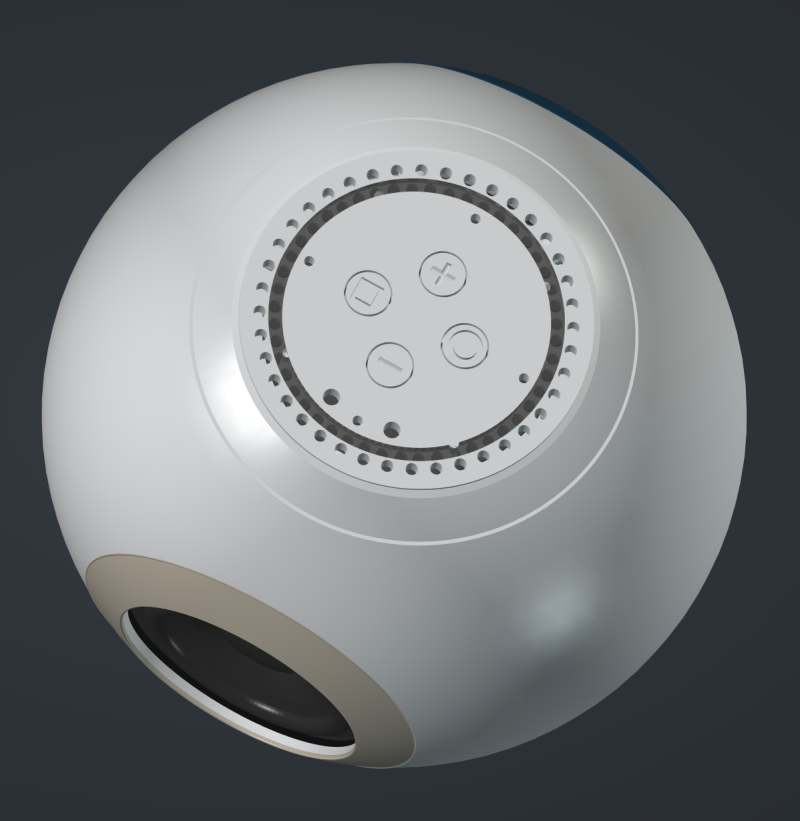
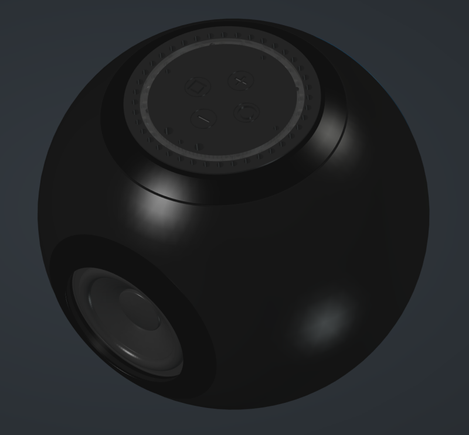

# BarrelSat One

**Timeless beauty with modern capability.**

A premium, fully local smart speaker that honors classic proportions and craftsmanship while delivering exceptional modern performance.

## Design Philosophy: Quiet Quality

I believe beautiful objects should feel like they belong to a longer timeline. They should honor classic proportions, craftsmanship, and timeless aesthetics, while quietly incorporating modern functionality and performance.

I’m drawn to classic architecture and traditional methods not for nostalgia, but because they have already proven what is beautiful and enduring over centuries. 

My goal is to take that inherited sense of **Quiet Quality** and pair it with honest modern engineering — so the object doesn’t just look timeless, it also works exceptionally well in the present.

# BarrelSat One

A premium, fully local smart speaker designed as a spiritual successor to the Amazon Echo 4th Gen, built with superior acoustics, thoughtful craftsmanship, and complete privacy.

**BarrelSat One** — Handcrafted with thoughtful engineering and quiet luxury aesthetics.

---
  
## Current Status
**Progress: ~95% Complete** — Working on fine tuning the print process.

  
## Gallery

**Fully assembled BarrelSat One**

---

**Cutaway view showing internal layout**

---

**Top module detail with grille and controls**

---

**Angled view highlighting possibility of multiple surface finishes**

  
## Design Architecture

Three-part modular enclosure:

* **Central Barrel** — Spherical form, 200 mm diameter × 175 mm tall with 2.5 mm walls and elegant exterior speaker banding
* **Top Module** — Houses Satellite1 board, upward-firing tweeter, and diffuser ring
* **Bottom Module** — Weighted base with crossover, LD2450 presence sensor, TPU sealing ring, and magnetic attachment

## Key Specifications

* **Drivers**: Dual opposing Dayton Audio PC83-4 3" woofers + Dayton ND25FA-4 upward firing tweeter
* **Acoustic Volume**: Targeting 3.0 liters usable
* **Materials**: PETG with strategic thinning at drivers
* **Sealing**: TPU gaskets + magnetic closure system
* **Integration**: Fully local via Home Assistant + Music Assistant
* **Security**: Privacy-focused local design

## Quick Links

### Documentation
- [Hardware Materials](Docs/Hardware_Materials.md)
- [Design Decisions](Docs/Design_Decisions.md)
- [Build Guide](Docs/Build_Guide.md)

### Source Files
- [Source Files](/Source/)

### Printable Files
- [3mf Print Plates](/3MF_Print_Plates/)
- [STLs](/STLs/)
 

  
## Remaining Tasks

See the '[Remaining Tasks](Docs/Remaining_Tasks.md)' file for the detailed punch list.

  
**Built entirely with Linux open-source software. Modeled in FreeCad and printed with Orca Slicer.**  
**Designed in collaboration with Grok (xAI)**

---
